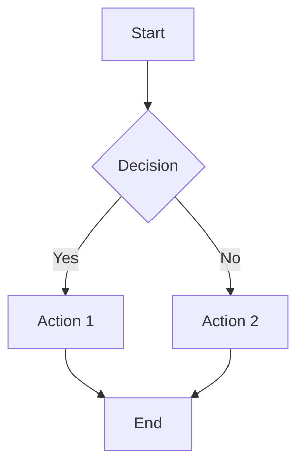
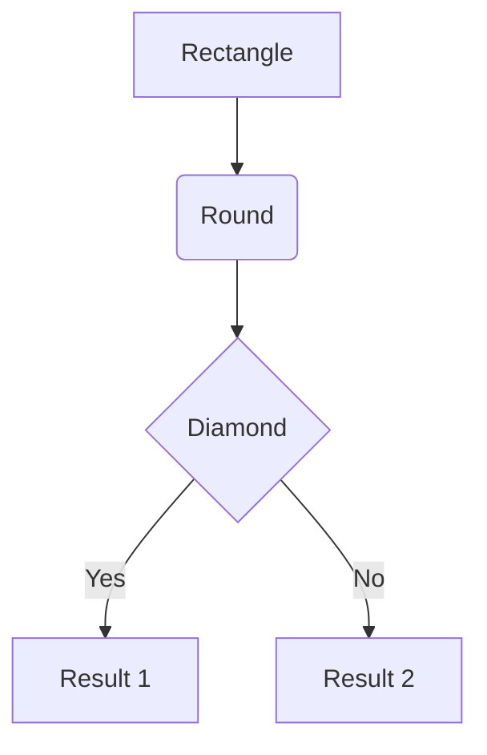
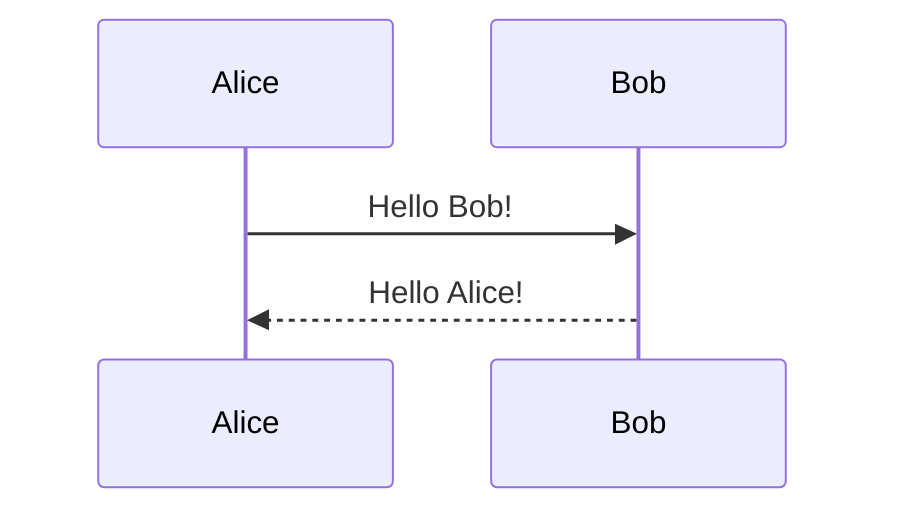
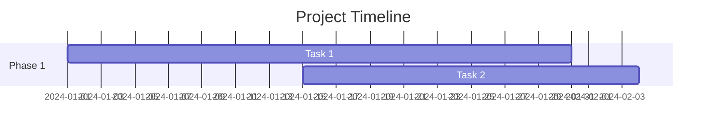

# MMChart - Online Mermaid Diagram Editor

[](https://www.mmchart.com)
[](LICENSE)
[](https://github.com/yourusername/mmchart)

> A professional online Mermaid diagram editor with real-time preview. Write code on the left, see beautiful diagrams on the right.

## 🚀 Features

- **Split-Screen Interface**: Code editor on the left, live preview on the right
- **Real-Time Rendering**: Instant diagram updates as you type
- **Multiple Diagram Types**: Flowcharts, sequence diagrams, Gantt charts, pie charts, and more
- **Quick Templates**: Pre-built examples to get started quickly
- **Export Options**: Download diagrams as SVG or PNG
- **Zoom & Pan**: Navigate large diagrams with ease
- **Responsive Design**: Works perfectly on desktop and mobile
- **No Registration Required**: Start creating diagrams immediately
- **Completely Free**: No hidden costs or limitations

## 🎯 Demo

Visit [www.mmchart.com](https://www.mmchart.com) to try it live!

## 📊 Supported Diagram Types

- **Flowcharts**: Visualize processes and workflows
- **Sequence Diagrams**: Show interactions between entities
- **Gantt Charts**: Project timeline management
- **Pie Charts**: Data visualization
- **Class Diagrams**: Object-oriented design
- **State Diagrams**: System state transitions
- **Entity Relationship Diagrams**: Database design
- **User Journey Maps**: User experience flows

## 🛠 Technology Stack

- **Frontend**: Vanilla HTML5, CSS3, JavaScript (ES6+)
- **Diagram Engine**: [Mermaid.js](https://mermaid.js.org/) v10.6.1
- **Deployment**: Vercel with global CDN
- **Performance**: Optimized for fast loading and smooth rendering

## 🚀 Getting Started

### Online Usage
1. Visit [www.mmchart.com](https://www.mmchart.com)
2. Choose a template or start writing Mermaid code
3. See your diagram update in real-time
4. Export when ready

### Local Development
```bash
# Clone the repository
git clone https://github.com/yourusername/mmchart.git

# Navigate to project directory
cd mmchart

# Open in browser
open index.html
# or use a local server
python -m http.server 8000
```

## 📝 Quick Example



## 🎨 Mermaid Syntax Guide

### Flowchart


### Sequence Diagram


### Gantt Chart


## 🌟 Why Choose MMChart?

| Feature | MMChart | Other Tools |
|---------|---------|-------------|
| **Speed** | Instant loading | Often slow |
| **Price** | Completely free | Many require subscription |
| **Simplicity** | Clean, focused UI | Often cluttered |
| **AI Integration** | Coming soon | Limited |
| **Export Quality** | High-resolution | Variable quality |
| **Learning Curve** | Minimal | Often steep |

## 🔮 Roadmap

- [ ] **AI Integration**: Generate diagrams from natural language
- [ ] **Cloud Save**: Save and sync diagrams across devices
- [ ] **Collaboration**: Real-time collaborative editing
- [ ] **More Templates**: Industry-specific diagram templates
- [ ] **API Access**: Programmatic diagram generation
- [ ] **Plugin System**: Extend functionality with plugins
- [ ] **Advanced Export**: PDF, Word, PowerPoint export
- [ ] **Team Features**: Workspace and permission management

## 🤝 Contributing

We welcome contributions! Here's how you can help:

1. **Fork** the repository
2. **Create** a feature branch (`git checkout -b feature/amazing-feature`)
3. **Commit** your changes (`git commit -m 'Add amazing feature'`)
4. **Push** to the branch (`git push origin feature/amazing-feature`)
5. **Open** a Pull Request

### Development Guidelines
- Follow existing code style
- Test on multiple browsers
- Ensure responsive design
- Update documentation

## 📄 License

This project is licensed under the MIT License - see the [LICENSE](LICENSE) file for details.

## 🙋‍♂️ Support

- **Website**: [www.mmchart.com](https://www.mmchart.com)
- **Issues**: [GitHub Issues](https://github.com/yourusername/mmchart/issues)
- **Email**: support@mmchart.com
- **Documentation**: [Mermaid.js Docs](https://mermaid.js.org/)

## 🏆 Acknowledgments

- [Mermaid.js](https://mermaid.js.org/) - The amazing diagramming library
- [Vercel](https://vercel.com) - Deployment and hosting platform
- The open-source community for inspiration and feedback

## 📈 Stats


---

**Made with ❤️ for the developer community**

*Turn your ideas into beautiful diagrams - because every great project starts with a clear visual plan.*